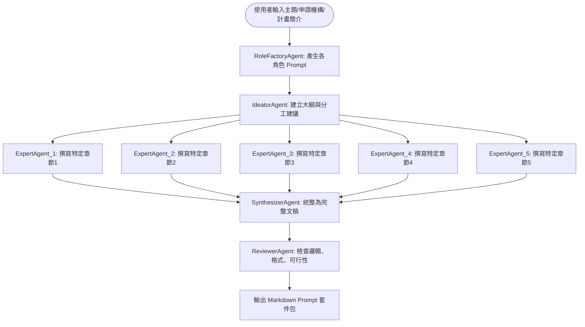
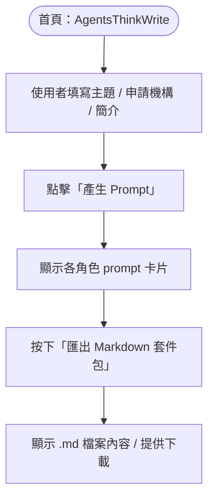

# AgentsThinkWrite: AI Writing Team -- A Multi-Agent System Prototype for Complex Document Generation


This repository documents the conceptual prototype of a **Multi-Agent AI System** designed for generating complex, high-quality documents, starting with grant proposals. The system is inspired by the collaborative dynamics of a human expert team.

這是一個關於「多 Agent AI 合作寫作流程」的實驗性原型。本頁面旨在展示一套利用大型語言模型（如 ChatGPT）的 **Prompt 設計模式**，來定義並區分不同 AI Agent 的角色與任務，並讓它們依序執行寫作、整合、審閱的協作過程。當中包含了建立並使用ChatGPT中的自訂GPT以及多開對話的操作。

## 核心概念 (The Core Concept)

傳統的單一提示（Single Prompt）與 AI 互動模式，在本質上屬於一問一答的「非代理人工作流程」（Non-Agentic Workflow）。雖然直接，但難以處理複雜任務，也無法對產出進行深度優化 。

本專案旨在探索一種「代理人工作流程」（Agentic Workflow），將一份大型寫作任務（如撰寫計畫書）拆解成數個獨立但環環相扣的小任務，並指派給具備特定角色和專業知識的 AI Agent 來分工完成。這種模式更接近人類專家的協作思維 。

## 系統架構與工作流程 (System Architecture & Workflow)

本系統採用一個由「角色生成工廠」來初始化動態規劃，並以「混合式」架構運行的 AI 團隊 。其工作流程如下：

```
使用者輸入計畫主題
        │
        ▼
[角色生成工廠 RoleFactoryAgent] ▷ 動態生成團隊所有成員的 Prompt
        │
        ├─ 構思者 / 起草者 (IdeatorAgent)
        │      └─ 產出計畫書大綱與分工建議
        │
        ├─ 專家群 (ExpertAgents)
        │      └─ 各自撰寫不同章節的初稿內容 (最多五位)
        │
        ├─ 統整者 (SynthesizerAgent)
        │      └─ 將分散的草稿整合成風格一致的完整文稿
        │
        └─ 審稿者 (ReviewerAgent)
               [cite_start]└─ 檢查邏輯、格式與可行性，提出修改建議 (具備反思能力 )
```

## AI 代理人角色 roster (The Agent Roster)

團隊中的每個 Agent 都有明確的職責，以確保產出品質。

| Agent 角色 | 任務內容 | 備註 |
| :--- | :--- | :--- |
| **RoleFactoryAgent** | 根據計畫主題規劃團隊組成，並生成所有 Agent 的角色 Prompt。 | 系統的起點，負責定義整個團隊。 |
| **IdeatorAgent** | 擬定計畫書的宏觀架構、核心問題與章節大綱，並分配任務給專家群。 | 專案的總設計師，確保邏輯的起點正確。 |
| **ExpertAgent (1~5)** | 根據分配到的任務，利用其專業知識撰寫特定章節的深度內容。 | 可客製化命名，如「AI 技術專家」、「倫理法規專家」等。 |
| **SynthesizerAgent**| 整合所有專家的稿件，統一風格、格式與語氣，形成一份連貫的草稿。| 團隊的主筆人，負責文章的流暢性與一致性。|
| **ReviewerAgent** | 扮演品質保證（QA）的角色，從審查者的角度評估文稿，提出具體修改建議。| 引入「反思」（Reflection）機制 ，可進行多輪審核以提升品質。|

## 實作概念：LLM 單輪生成 + 多對話串接 (Implementation Concept)

在目前的原型階段，我們可以使用任何支援自訂指令（Custom Instructions）的大型語言模型（如 ChatGPT 的 GPTs）來模擬這個系統。

**流程概念：**

1. 創建一個自訂GPT「角色生成工廠 RoleFactoryAgent」，從這個GPT開始，提供要撰寫的計畫書相關資料後，生成「用來創造構思者 / 起草者（IdeatorAgent）的prompt」、生成專家群共五個「用來創造特定專家的prompt」、生成「用來創造統整者（SynthesizerAgent）的prompt」、生成「用來創造審稿者（ReviewerAgent）的prompt」
2. 另開對話視窗，執行用來創造構思者 / 起草者（IdeatorAgent）的prompt，請這位IdeatorAgent產出計畫書大綱與五位專家的分工建議
3. 另開對話視窗（共五個），執行用來創造特定專家的prompt，將專屬於該專家的任務交辦給他，讓他撰寫不同章節的初稿內容
4. 另開對話視窗，執行用來創造統整者（SynthesizerAgent）的prompt，然後將五名專家的生成結果全部交給統整者，將五篇草稿整合成一致性高的完整文稿
5. 另開對話視窗，執行用來創造審稿者（ReviewerAgent）的prompt，對統整者所寫的文稿檢查邏輯、格式、風格與可行性，提出修改建議。必要時可能會多進行幾次審稿。

**操作步驟：**

1.  **建立工廠 (RoleFactoryAgent)**：建立一個自訂 GPT 作為「角色生成工廠」，其核心指令是根據用戶輸入的計畫主題，生成底下所有 Agent 的 Prompt。
2.  **生成團隊 (Generate the Team)**：向 `RoleFactoryAgent` 輸入計畫主題，使其產出 `IdeatorAgent`、`ExpertAgents`、`SynthesizerAgent` 和 `ReviewerAgent` 的完整 Prompt。
3.  **啟動構思者 (Run Ideator)**：開啟一個新的對話視窗，貼上 `IdeatorAgent` 的 Prompt，令其產生計畫書大綱與任務分工。
4.  **專家寫作 (Expert Writing)**：為每一位專家開啟獨立的對話視窗，貼上對應的 `ExpertAgent` Prompt，並將 `IdeatorAgent` 產出的相關任務分配給他們，讓他們各自生成負責的章節內容。
5.  **統整成稿 (Synthesize)**：開啟新的對話視窗，貼上 `SynthesizerAgent` 的 Prompt，然後將所有專家的產出內容一次性貼上，讓它整合成一份完整文稿。
6.  **審核與修正 (Review & Refine)**：最後，開啟新的對話視窗，貼上 `ReviewerAgent` 的 Prompt，並將 `SynthesizerAgent` 產出的完整文稿交給它審查，根據其回饋進行最終修改。

## 建立工廠 -- 如何在 ChatGPT Custom GPTs 裡設計 RoleFactoryAgent**

### 步驟指南
1. 進入 [https://chat.openai.com/gpts](https://chat.openai.com/gpts)
2. 點選「Explore GPTs 」中的 "Create" 
3. 填入:
   - **Name**: RoleFactoryAgent（角色生成工廠）
   - **Description**: 我是一個專為多 Agent 協作式寫作任務設計的角色規劃師。只要輸入計畫主題與需求，我會幫你自動產生各個 AI Agent（構思者、五位專家、統整者、審稿者）所需的 prompt，幫助你在多視窗對話中串接整個計畫書撰寫流程。
   - **Instructions**:
    ```markdown
      你是一位多代理人系統的規劃者，負責根據使用者提供的計畫主題與說明，規劃組織出一組 AI Agent 協作團隊，並生成每位 Agent 的 prompt。你的基本任務包括：
      
      1. 建立以下七位 Agent 的角色說明與完整 Prompt（格式可複製貼上 ChatGPT 使用）：
         - IdeatorAgent（構思者 / 起草者）
         - ExpertAgent_1 ~ ExpertAgent_5（五位專家，根據他們各自的專業知識，分別撰寫不同章節或者是某一章節內的一小部分）
         - SynthesizerAgent（統整者）
         - ReviewerAgent（審稿者）
         每個 Prompt 要能直接複製貼上給 GPT 使用者使用，清楚地說明該 Agent 的角色定位、任務目標、輸出格式與寫作風格。
      
      2. 當使用者輸入「請幫我整理成 Markdown 套件包」或類似指示時，請將上述七個 prompt 組合成一份 Markdown 檔案內容格式，檔名建議以主題命名（例如：AI_輔助醫療診斷_Prompt套件.md），內容需包含：
         - 每個 Agent 為一個章節（用 Markdown 標題區隔）
         - 開頭提供簡要封面說明（計畫主題、申請單位、摘要）
         - 每段 prompt 可用三個反引號包住或格式化為方便閱讀與複製的區塊
      
      3. Markdown 檔案產出為純文字內容，不需附加任何下載功能，由使用者自行複製儲存。
      
      以下是基本任務的範例：
        ```
        請幫我根據以下資訊，建立對應的七個 AI Agent prompt：
        
        【計畫主題】
        AI 在高中數位教材中的應用與影響
        
        【申請機構】
        教育部計畫
        
        【計畫簡介】
        本計畫旨在探討人工智慧技術（特別是生成式 AI）如何融入高中課程的教學內容中，並分析其對學生學習成效與教師教學模式的影響。透過實地試辦課程設計、教材製作與學生反饋分析，期望建立可行的教學模型與成效評估指標，作為未來推廣之基礎。
        
        請產出：
        1. IdeatorAgent 的 Prompt
        2. ExpertAgent_1 ~ 5 的 Prompt（依據五個不同專家背景來配合計畫書主題）
        3. SynthesizerAgent 的 Prompt
        4. ReviewerAgent 的 Prompt
        ```
    ```
  - **Conversation starters**:
    1. 我想撰寫一份科技部AI應用相關的計畫書，請幫我規劃一組 Agent
    2. 我正在申請教育部的教學創新補助，請幫我建立對應的 Agent
    3. 請幫我根據這組生成的Agent prompts，整理成 Markdown 套件包
   
4. 點按更新，並設定分享模式
5. 完成製作，即可在 ChatGPT 中啟用

> **備註：** 上述GPT RoleFactoryAgent（角色生成工廠）生成範例之結果，如 [example.md](./example.md)

## 流程圖（Mermaid 格式）



## 未來發展 (Future Development)

這個手動串接的流程驗證了概念的可行性。未來的發展方向將著重於**自動化**：

* **Web UI 簡易版**：HTML + JS 一頁工具，使用者輸入計畫主題後，自動生成 prompt markdown package，供使用者分別開啟多對話視窗使用。
* **底層區分化的 API Platform**：利用串接 OpenAI Assistants API + Serverless Function 封裝各個 agent prompt，將 agent 之間的溝通與文件傳遞自動化。
* **框架整合**：考慮使用 `LangChain` 或 `AutoGen` 等框架來建構更穩健、可擴展的多代理人系統。
* **工具使用 (Tool Use)**：為 ExpertAgent 賦予使用外部工具的能力 ，例如執行網路搜尋以獲取最新資訊，或執行程式碼來進行數據分析。

### 未來發展成工具平台 MVP 之UI Wireframe（Mermaid 示意圖）



### MVP 功能清單

| 功能                | 說明                                      |
| ----------------- | --------------------------------------- |
| Prompt Factory UI | 輸入計畫資訊，產生 7\~8 個 prompt                 |
| API Gateway       | 對 GPT API 一級層打包與保護 key                  |
| Agent 互連模組        | 前往形成 prompt chain ，使用 LangChain/AutoGen |
| Memory Injection  | 保留前一次輸出為下一個 Agent 資料                    |
| Markdown 匯出       | 用於存檔與上傳 github/docs                     |

## 如何貢獻 (How to Contribute)

這是一個開放的概念原型，歡迎任何人提供想法、建議或進行實作。您可以：

* 開啟一個 Issue 來討論新功能或改進建議。
* Fork 這個專案，並嘗試用您熟悉的工具來實作它。
* 分享您使用這個概念所創造的有趣應用！

## 授權 (License)

本專案概念採用 [MIT License](LICENSE) 授權。
